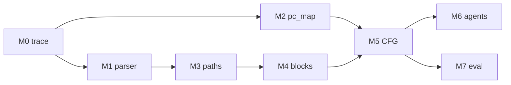

# Dynamic CFG Recovery — Project Plan

Recover **dynamic control-flow graphs** from Vortex **SimX** debug traces: basic blocks, edges, warp divergence, and reconvergence. Ground-truth workload: `tests/regression/diverge`.

**Tools (versioned):** `cfg_recovery/` in the repo  
**Artifacts (generated):** `build/cfg_recovery/` after `../configure`  
**Pipeline:** `cfg_recovery/run.sh` (writes under `build/cfg_recovery/out/`)

**Status:** Wave 4 complete (M6 lab kernels, M7 eval, demo script).

```sh
# Unit tests (from repo root)
python3 -m unittest discover -s cfg_recovery/tests -v

# Full flow — always start in build/
cd build
source ci/toolchain_env.sh
make -s
../cfg_recovery/capture_trace.sh tests/regression/diverge -n4
../cfg_recovery/run.sh
```

### M0 setup (Quick Start)

Vortex is configured and built **only from `build/`**:

```sh
mkdir -p build && cd build
../configure --xlen=32 --tooldir=$HOME/tools
source ci/toolchain_env.sh
make -s
```

Do **not** symlink `config.mk` into the repo root. Makefiles under `build/` set `ROOT_DIR` to the build tree, where `config.mk` lives.

**Trace capture** (writes `build/cfg_recovery/run.log`):

```sh
cd build
source ci/toolchain_env.sh
DEBUG=3 make -C runtime/simx
../cfg_recovery/capture_trace.sh tests/regression/diverge -n4
```

**Parse / pc_map** (defaults point at `build/cfg_recovery/` and `build/tests/.../kernel.elf`):

```sh
../cfg_recovery/run.sh
# or explicitly:
../cfg_recovery/run.sh cfg_recovery/run.log tests/regression/diverge/kernel.elf
```

`pc_map.py` reads `TOOLDIR` from the environment (set `export TOOLDIR=...` from `build/config.mk` if needed).

---

## Milestones

| ID | Milestone | Done when | Owner module |
|----|-----------|-----------|--------------|
| M0 | Baseline trace | `run.log` captured; `trace_csv.py` produces CSV | Human / shell |
| M1 | Trace parser | `parse_simx_log()` fills `InstructionEvent` list | `parse_simx.py` |
| M2 | PC symbol map | `pc_map.json` from kernel ELF | `pc_map.py` |
| M3 | Per-warp paths | Edge list per `warp_id` from events | `build_cfg.py` |
| M4 | Dynamic basic blocks | Blocks from PC runs + branch cuts | `build_cfg.py` |
| M5 | CFG + annotations | `cfg.json` + Graphviz output | `build_cfg.py`, `visualize.py` |
| M6 | Lab + obfuscated kernels | `cfg_diverge_lab`, `cfg_diverge_obf` regression apps | `tests/regression/` |
| M7 | Evaluation | `eval.py` rubric; `test_cfg_quality.py` | `cfg_recovery/eval.py` |

### M0 — Baseline

```sh
cd build
source ci/toolchain_env.sh
../cfg_recovery/capture_trace.sh tests/regression/diverge -n4
python3 ../ci/trace_csv.py -t simx cfg_recovery/run.log -o cfg_recovery/trace.csv
```

Kernel ELF: `build/tests/regression/diverge/kernel.elf`

### M1 — Parser

Implement `parse_simx_log()` using regex patterns from `ci/trace_csv.py` (`parse_simx`).

- Merge `DEBUG Instr:` with `TRACE` commit cycles per `uuid`.
- Output: `events.json` (see `InstructionEvent` in `parse_simx.py`).
- Test: `python3 -m unittest cfg_recovery.tests.test_parse` (extend tests when implemented).

### M2 — PC map

- `riscv*-objdump -t` / `-d` on kernel ELF.
- Map `pc` → `symbol+offset` for node labels.

### M3 — Warp paths

Per `warp_id`, ordered transitions:

- Edge when `pc` is not `prev_pc + 4` (branch/jump) or on commit boundary.
- Store `tmask` before/after, `cycle_commit`.

### M4 — Basic blocks

- Maximal contiguous `pc` sequences per warp path.
- Split on non-sequential PC; mark merge PCs (multiple predecessors).

### M5 — CFG export

- Nodes: blocks; edges: weighted transitions.
- Flags: `is_divergence_point`, `is_merge_point`, `divergent` on edges.
- `visualize.py` → `cfg.dot` / `cfg.png` (red edges = divergent).

### M6 — Lab kernels

| App | Purpose |
|-----|---------|
| `tests/regression/cfg_diverge_lab` | Small kernel with documented `if` / `loop` / `switch` (CFG ground truth) |
| `tests/regression/cfg_diverge_obf` | Same logic + opaque predicates (harder static reading) |

After adding apps, re-run `../configure` in `build/`, then `make -s`.

### M7 — Evaluation

```sh
python3 cfg_recovery/eval.py build/cfg_recovery/out/events.json build/cfg_recovery/out/cfg.json
```

| Metric | Threshold | Meaning |
|--------|-----------|---------|
| `pc_coverage` | ≥ 0.95 | Fraction of warp events whose PC lies in some CFG block |
| `edge_soundness` | ≥ 0.95 | Fraction of CFG edges matching a path transition |
| `divergent_edges` | ≥ 1 | At least one annotated divergent edge |

### Demo (M0–M7)

```sh
cd build && source ci/toolchain_env.sh
../configure   # picks up cfg_diverge_lab / cfg_diverge_obf
make -s
../cfg_recovery/demo.sh tests/regression/cfg_diverge_lab
# Obfuscated variant:
../cfg_recovery/demo.sh tests/regression/cfg_diverge_obf
```

Artifacts: `build/cfg_recovery/out/demo/` (`eval.json`, `cfg_warp0.dot`, …).

### Agent iteration example (documented fix)

1. **Symptom:** CFG edges used PC-only block IDs; loop re-entry collapsed blocks.
2. **Fix:** Key blocks by `first_uuid`; map path edges via instruction UUID.
3. **Verify:** `python3 -m unittest discover -s cfg_recovery/tests`; re-run `eval.py` on `diverge` trace.

---

## Dependency graph



**Parallelizable after M0:** M1 and M2 (no dependency on each other).  
**Parallelizable after M1:** M3 (paths) can start while M2 finishes.  
**Sequential:** M4 → M5 → M7. M6 overlaps once M5 produces first `cfg.png`.

---

## Agent orchestration

Use a **coordinator** (main Cursor agent or you) that owns git, runs `blackbox`, and merges PRs. Delegate **implementation** to subagents (`Task` tool, `subagent_type=explore` or `generalPurpose`) with narrow prompts and file boundaries.

### Wave 0 — Setup (sequential, ~30 min)

| Step | Agent? | Action |
|------|--------|--------|
| W0.1 | Human | Confirm build: `./ci/blackbox.sh --driver=simx --app=diverge --debug=3` |
| W0.2 | Shell subagent | Capture `run.log`, locate kernel ELF path, note `CONFIGS` line |
| W0.3 | Coordinator | Commit stub (already in tree); open tracking issue per milestone |

**Shell subagent prompt:**

```text
From vortex repo root: run blackbox diverge debug=3, save log to cfg_recovery/run.log.
Find the built kernel ELF under tests/regression/diverge and print its path.
Do not modify source except copying the log.
```

---

### Wave 1 — Parallel track A + B (after M0)

#### Track A — Parser agent (M1)

**Scope:** `cfg_recovery/parse_simx.py`, `cfg_recovery/tests/test_parse.py`, `cfg_recovery/tests/fixtures/`

**Prompt:**

```text
Implement parse_simx_log() in cfg_recovery/parse_simx.py.
Reference ci/trace_csv.py parse_simx() for regex and pipeline uuid handling.
Load config via load_config(); emit InstructionEvent with cycle_* from TRACE commit.
Add unittest: fixture cfg_recovery/tests/fixtures/diverge_snippet.log must parse ≥2 events.
Do not change build_cfg.py or visualize.py.
Run: python3 -m unittest cfg_recovery.tests.test_parse
```

**Deliverable:** Green tests; sample `events.json` from real `run.log` (small `-n4` run).

#### Track B — PC map agent (M2)

**Scope:** `cfg_recovery/pc_map.py` only

**Prompt:**

```text
Implement build_pc_map() in cfg_recovery/pc_map.py using riscv objdump on kernel ELF.
Resolve objdump from RISCV_TOOLCHAIN_PATH if set (see ci/toolchain_env.sh).
Output PcMap JSON: pc hex string, symbol name, offset.
Add a small __main__ self-test or unittest under cfg_recovery/tests/test_pc_map.py.
Do not modify parse_simx.py.
```

**Deliverable:** `pc_map.json` for diverge kernel.

**Merge:** Coordinator runs both; fix import conflicts if any.

---

### Wave 2 — Parallel track C + D (after M1)

#### Track C — Path builder (M3)

**Scope:** `build_cfg.py` — functions through `build_warp_paths()` only

**Prompt:**

```text
In cfg_recovery/build_cfg.py implement build_warp_paths(parsed: ParsedTrace).
Return dict[warp_id, list[edge records]] for PC transitions (non pc+4).
Use tmask and cycle_commit from InstructionEvent.
Add tests with synthetic events in test_build_cfg.py.
```

#### Track D — Visualization scout (M5 prep)

**Scope:** `visualize.py` — DOT format spec only (can stub `cfg_to_dot` with mock JSON)

**Prompt:**

```text
Design Graphviz DOT export for cfg.json schema in build_cfg.py dataclasses.
Implement cfg_to_dot() for a minimal hand-written cfg dict in visualize.py.
Use red dashed edges for divergent= true; subgraph per warp_id.
Document graphviz apt dependency in cfg_recovery/README.md.
```

**Parallel note:** Track D can use **mock** `cfg.json` until M5; Track C needs real M1 output.

---

### Wave 3 — Sequential core (M4 + M5)

Single **CFG agent** (depends on M3 + M2):

**Prompt:**

```text
Complete build_cfg.py: build_basic_blocks(), build_dynamic_cfg(), wire pc_map labels.
Implement visualize.cfg_to_dot() against real cfg.json.
End-to-end: run.sh cfg_recovery/run.log <elf> must produce out/cfg.png.
Validate on diverge: divergence near kernel.cpp nested if (task_id > 1).
```

**Explore subagent** (read-only) — run before CFG agent if stuck:

```text
Read tests/regression/diverge/kernel.cpp and correlate branch structure to PCs
using objdump -d on the kernel ELF. List expected branch PCs for warps 0 vs 2.
```

---

### Wave 4 — Parallel polish (after M5)

| Agent | Scope | Task |
|-------|-------|------|
| **Eval agent** | `cfg_recovery/tests/`, `docs/cfg_recovery.md` | M7 rubric scripts; coverage % |
| **Kernel agent** | `tests/regression/diverge_obfuscated/` or `cfg_recovery/kernels/` | M6 opaque-predicate variant |
| **Docs agent** | `docs/cfg_recovery.md` | Agent playbook examples from real chat logs |

**Eval agent prompt:**

```text
Add cfg_recovery/tests/test_cfg_quality.py: given cfg.json + run.log,
compute edge soundness (edges ⊆ trace) and PC coverage.
Document pass thresholds in docs/cfg_recovery.md M7 section.
```

**Kernel agent prompt:**

```text
Add a minimal Vortex regression kernel cfg_recovery/kernels/branch_lab/
with if/else, while, switch (no OpenCL). Copy Makefile pattern from tests/regression/basic.
Document how to capture trace with blackbox.
```

---

### Wave 5 — Coordinator closeout

1. Run full pipeline on `diverge` + `branch_lab`.
2. Paste one **agent iteration** into docs (bad merge → fix prompt → good `cfg.png`).
3. Optional: `rename_chat` to "CFG recovery — diverge demo".

---

## Prompt templates (copy-paste)

### Handoff to any subagent

```text
Context: Vortex GPGPU SimX dynamic CFG recovery.
Read docs/cfg_recovery.md and cfg_recovery/README.md first.
Milestone: <Mx>
Allowed files: <list>
Forbidden: hw/, sim/simx/ (unless explicitly asked)
Verify: <command>
```

### Feedback loop (after human inspects graph)

```text
CFG recovery bug report:
- Log: cfg_recovery/run.log (warp <w>, -n<size>)
- Missing edge: PC 0x<A> → 0x<B>
- False merge at PC 0x<C>
- Expected: see diverge/kernel.cpp lines <L1>-<L2>

Fix build_cfg.py reconvergence heuristic only; keep parse_simx.py unchanged.
Re-run unittest and regenerate cfg_recovery/out/cfg.png.
```

---

## Completion plan (calendar)

| Week | Coordinator | Subagents (parallel where noted) |
|------|-------------|----------------------------------|
| 1 | M0; merge stub | **A** M1 parser ∥ **B** M2 pc_map |
| 2 | Integrate; review events.json | **C** M3 paths ∥ **D** DOT design |
| 3 | E2E run.sh | **CFG** M4+M5; **explore** PC correlation if stuck |
| 4 | Demo + report | **Eval** M7 ∥ **Kernel** M6; **Docs** playbook |

**Project complete when:**

- `./cfg_recovery/run.sh cfg_recovery/run.log <kernel.elf>` → `out/cfg.json` + `out/cfg.png`
- M7 tests pass on `diverge`
- `docs/cfg_recovery.md` contains one documented agent fix iteration

---

## Risks (plan buffers)

1. **Log size** — use `-n4` / few warps for development.
2. **tmask** — confirm decimal vs bitstring in real logs in M1 first line of agent report.
3. **Micro-ops / ibuffer** — prefer commit-time PC from TRACE, not fetch-only lines.
4. **Uniform branches** — annotate divergence only when successors or `tmask` disagree across lanes.

---

## Related tools

- `ci/trace_csv.py` — reference parser, CSV export
- `ci/blackbox.sh --debug=N` — trace capture
- `tests/regression/diverge/kernel.cpp` — ground-truth control flow
