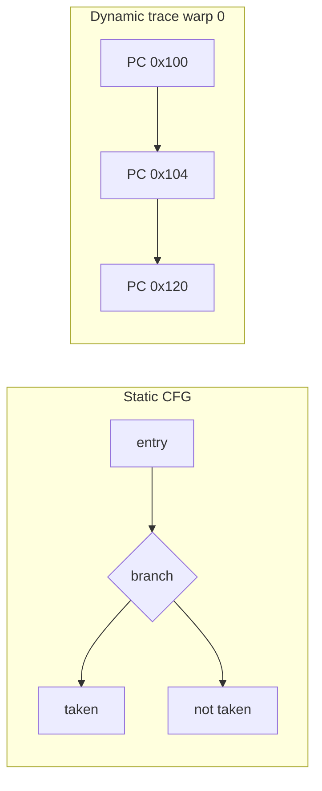

# Dynamic CFG Recovery on Vortex — Slide Deck Template

Use this outline as copy for PowerPoint, Google Slides, or Beamer. Suggested visuals are ASCII/mermaid you can redraw as diagrams.

**Audience:** Course project / technical demo (9–10 slides + optional backup)  
**Duration:** ~6 minutes talk + live demo (~3 min if rehearsed). *Add ~90 s if you include the two security framing slides.*

---

## Slide 1 — Title

**Title:** Dynamic Control-Flow Recovery from Vortex SimX Traces  

**Subtitle:** Security-oriented visibility into GPU control flow (software-only, no RTL changes)

**Your name / course / date**

**Suggested visual:** Vortex logo or simple stack icon: `Untrusted kernel → SimX → Trace → CFG → Analysis`

**Speaker notes (15 s):**  
“This is a security-oriented analysis project: we recover control flow from GPU execution traces so we can see what untrusted or obfuscated code actually did—not just what the source claims.”

---

## Slide 2 — Why this is a security project (not “just graphs”)

**Headline:** GPU kernels are an attack surface; control flow is how attacks move

**Bullets:**
- **Untrusted code runs on GPUs:** OpenCL/Vortex kernels from apps, drivers, or supply chain—you often **cannot trust source** (malware, obfuscation, buggy host-provided pointers).
- **Security questions are control-flow questions:** Did execution reach a dangerous path? Which **branches** depend on attacker input? Where do warps **diverge** (hidden behavior per thread)?
- **Static analysis is easy to evade:** Opaque predicates, dead code, and anti-disassembly hide intent in the **binary**; what matters is what **ran** under a realistic input.
- **Industry precedent:** Dynamic CFG recovery from traces is a standard step in **malware analysis**, firmware RE, and CFI research—we adapt it to **SIMT / Vortex**, where warps and `tmask` add GPU-specific leakage of behavior.

**Suggested diagram (security analyst workflow):**

```
Untrusted GPU kernel          Analyst needs
┌──────────────────┐          ┌─────────────────────────────┐
│ obfuscated .vxbin│          │ What paths actually executed?│
│ or no source     │   ──▶    │ Where are branches / merges? │
│ malicious input  │          │ Evidence for later taint/CFI │
└──────────────────┘          └─────────────────────────────┘
         │                                    ▲
         └──────── SimX trace ──▶ CFG ────────┘
```

**Speaker notes (45 s):**  
“Security isn’t only finding buffer overflows. For GPU code, you need visibility: did this kernel take the branch that uses a host pointer as an address? Our project automates that visibility from the simulator trace. We’re not claiming a full exploit detector yet—we’re building the control-flow layer security tools depend on.”

---

## Slide 3 — What we deliver vs what comes next

**Headline:** End-to-end *for control-flow recovery*; foundation for deeper security

**Bullets:**

| In scope (this project) | Natural extensions (not required for demo) |
|-------------------------|-------------------------------------------|
| Dynamic CFG from SimX trace | **Taint:** follow untrusted input to branches/pointers |
| Warp-aware divergence & merge flags | **Diff:** lab vs obfuscated kernel CFG |
| Quantitative validation vs trace | **Policy:** alert on unexpected reachable blocks |
| Lab + obfuscated test kernels | **CFI / exploit paths:** unexpected control transfers |

- **Security value today:** reproducible **evidence** of executed control flow (JSON + graph + `eval.json`), including on **obfuscated** code where source lies.
- **Comparable ideas from literature:** trace-based RE (e.g. firmware CFG recovery); outsourced-computation verification (control-flow integrity)—we stay **software-only** on Vortex SimX.

**Suggested diagram (layer cake):**

```
┌─────────────────────────────────────┐
│  Later: taint, policies, CFI checks │  ← future
├─────────────────────────────────────┤
│  This project: dynamic CFG + metrics │  ← you are here
├─────────────────────────────────────┤
│  SimX debug trace (PC, warp, tmask) │
├─────────────────────────────────────┤
│  Vortex kernel execution            │
└─────────────────────────────────────┘
```

**One-liner for skeptics (put in large text on slide):**  
*“You cannot secure what you cannot see—CFG recovery makes GPU control flow visible.”*

**Speaker notes (40 s):**  
“Creating CFGs isn’t the end of security analysis; it’s the piece that makes the rest plausible. Malware analysts don’t stop at a graph—they use it to guide where to look. We deliver that graph for Vortex, with validation so it’s tied to the trace, plus an obfuscated kernel to show the graph still exposes real branches when the source doesn’t.”

---

## Slide 4 — Problem (technical)

**Headline:** Why static CFGs miss GPU reality

**Bullets:**
- Vortex runs kernels as **warps** of threads with a **thread mask** (`tmask`): branches can diverge and reconverge.
- A **static** CFG shows what the code *could* do; a **dynamic** CFG shows what *actually ran* in simulation.
- Goal: recover blocks, edges, and **divergence** from SimX traces for automated analysis.

**Suggested diagram (split panel):**

```
Static view (source)          Dynamic view (trace)
┌─────────────────┐          ┌─────────────────┐
│  if (tid > 1)   │          │ warp0: A→B→C    │
│    f();         │   vs     │ warp1: A→D→C    │
│  else g();      │          │ merge at C      │
└─────────────────┘          └─────────────────┘
```

**Optional mermaid (redraw in slide tool):**



**Speaker notes (45 s):**  
“On a CPU you might read a disassembly. On a GPU, threads in a warp share instruction fetch but can take different paths. We use the simulator’s debug output—PC, warp ID, mask per instruction—to reconstruct what happened at runtime.”

---

## Slide 5 — Approach / Architecture

**Headline:** Trace-driven pipeline (agent-friendly design)

**Bullets:**
- **Input:** SimX `run.log` (`DEBUG Instr` + pipeline `TRACE` lines) + kernel ELF for symbols.
- **Stages:** parse events → warp path edges → dynamic basic blocks → CFG + annotations → Graphviz.
- **Output:** `cfg.json`, `eval.json`, `.dot` / PNG per warp.
- All artifacts live under **`build/cfg_recovery/`** after Vortex Quick Start.

**Suggested diagram (pipeline — main visual for this slide):**

```
┌──────────────┐    ┌──────────────┐    ┌──────────────┐    ┌──────────────┐
│  diverge /   │    │  parse_simx  │    │  build_cfg   │    │ visualize +  │
│  lab kernel  │───▶│  events.json │───▶│  cfg.json    │───▶│ eval.json    │
│  + SimX      │    │  pc_map.json │    │ warp_paths   │    │ cfg_warp0    │
└──────────────┘    └──────────────┘    └──────────────┘    └──────────────┘
     M0                  M1–M2               M3–M5               M7
```

**Tool names (small footer):** `capture_trace.sh` · `run.sh` · `demo.sh` · `eval.py`

**Speaker notes (50 s):**  
“Nothing modifies the RTL. We configured Vortex in `build/`, captured a debug trace, and ran Python tools we versioned in `cfg_recovery/`. The same flow is scriptable—designed so an agent can iterate on parsing or block boundaries when something looks wrong in the graph.”

---

## Slide 6 — What we recover

**Headline:** Dynamic basic blocks and annotated edges

**Bullets:**
- **Block:** maximal run of fallthrough instructions in *trace order* (re-visited PCs = new dynamic blocks).
- **Edge:** transition between blocks; **red / dashed** in Graphviz if branch, mask change, or divergent.
- **Nodes flagged:** divergence point (multiple exits / branch exit), merge point (multiple incoming edges).
- **Symbols:** `kernel.elf` → function names on blocks via `llvm-objdump`.

**Suggested diagram (CFG fragment mockup):**

```
        ┌──────────────────────┐
        │ c0w0_#42             │
        │ 0x800002f0 – 0x8002f4│
        │ kernel_body+0x…      │
        └──────────┬───────────┘
                   │ fallthrough
                   ▼
        ┌──────────────────────┐
        │ c0w0_#58  ◆ diverge  │
        │ 0x80000310           │
        └─────┬──────────┬─────┘
              │ branch     │ branch
              ▼            ▼
           [block A]    [block B]
              └────┬───────┘
                   ▼ merge ◇
              [block C]
```

**Legend box on slide:**  
◆ divergence · ◇ merge · **red dashed** = divergent edge

**Speaker notes (45 s):**  
“This is not LLVM IR. Blocks are defined by what SimX committed, in order. That’s why loops create multiple block instances—it’s a feature for dynamic analysis, though graphs can get large on long runs.”

---

## Slide 7 — Validation (M7)

**Headline:** How we know the CFG is trustworthy

**Bullets:**
| Metric | Threshold | Meaning |
|--------|-----------|---------|
| PC coverage | ≥ 95% | Executed PCs appear in some block |
| Edge soundness | ≥ 95% | Each CFG edge backed by a trace transition |
| Divergent edges | ≥ 1 | Branch/divergence captured |

- **Lab kernel:** `cfg_diverge_lab` — small, documented `if` / `loop` / `switch`.
- **Obfuscated variant:** `cfg_diverge_obf` — opaque predicates, same semantics.
- **Unit tests:** 12 tests on fixtures + parsers.

**Suggested diagram:** Screenshot placeholder — box labeled “paste `eval.json` snippet” showing `"passed": true`.

**Speaker notes (40 s):**  
“We don’t claim bit-exact equivalence to a gold static CFG. We check coverage and soundness against the same trace that built the graph. On the lab kernel, warp 0 passes all thresholds.”

---

## Slide 8 — Live demo (title only during demo)

**Headline:** Live demo

**On-slide text (minimal):**
```sh
cd build && source ci/toolchain_env.sh
../cfg_recovery/demo.sh tests/regression/cfg_diverge_lab
# open cfg_recovery/out/demo/cfg_warp0.dot
```

**Suggested visual:** Terminal screenshot placeholder + Graphviz PNG placeholder.

*(See `docs/cfg_recovery_demo_script.md` for timed script.)*

---

## Slide 9 — Limitations & future work (optional backup)

**Headline:** Honest limits

**Bullets:**
- Graph size grows on long runs (`-n4` recommended for slides).
- Dynamic blocks ≠ static basic blocks; loop re-entry duplicates nodes.
- Requires **debug-built** `libsimx.so` (`DEBUG=3`).
- Future: compare lab vs obf CFG diff; static–dynamic alignment; cache-timing track (alternate project).

**Speaker notes (30 s, if time):**  
“Scope was software-only trace analysis. The obfuscated kernel is there to show the trace still recovers real branches even when source looks noisy.”

---

## Slide 10 — Summary (closing)

**Headline:** Takeaways

**Bullets:**
1. **Security motivation:** untrusted/obfuscated GPU code requires **dynamic** control-flow evidence, not source trust alone.
2. **SimX debug traces are enough** to recover warp-level CFGs on Vortex with divergence metadata.
3. **End-to-end automation:** capture → JSON → graph → quantitative eval (`demo.sh`).
4. **Obfuscated lab kernel** shows branches remain visible when static reading fails.

**Contact / repo path:** `vortex/cfg_recovery/` · `docs/cfg_recovery.md`

---

## Suggested diagrams checklist (for your slide tool)

| # | Diagram | Slide |
|---|---------|-------|
| 1 | Untrusted kernel → trace → CFG (security workflow) | 2 |
| 2 | Layer cake: trace / CFG / future taint | 3 |
| 3 | Stack/pipeline horizontal flow | 1, 5 |
| 4 | Static vs dynamic branch (two columns) | 4 |
| 5 | Pipeline boxes with file names | 5 |
| 6 | Mini CFG with red dashed edge + legend | 6 |
| 7 | `eval.json` screenshot with passed=true | 7 |
| 8 | Terminal + Graphviz screenshot | 8 |
| 9 | Lab source vs obf source (optional side-by-side) | 3 or 10 |

---

## Assets to capture before presenting

1. `build/cfg_recovery/out/demo/eval.json` (warp 0, `"passed": true`)
2. `build/cfg_recovery/out/demo/cfg_warp0.dot` opened in Graphviz (export PNG)
3. Optional: side-by-side `cfg_diverge_lab/kernel.cpp` snippet (lines with `CFG_LAB_FLAT`) and graph crop
4. Optional: `diverge` vs `cfg_diverge_lab` edge count comparison (one line of numbers)

**Graphviz install (for PNG):** `sudo apt install graphviz`
